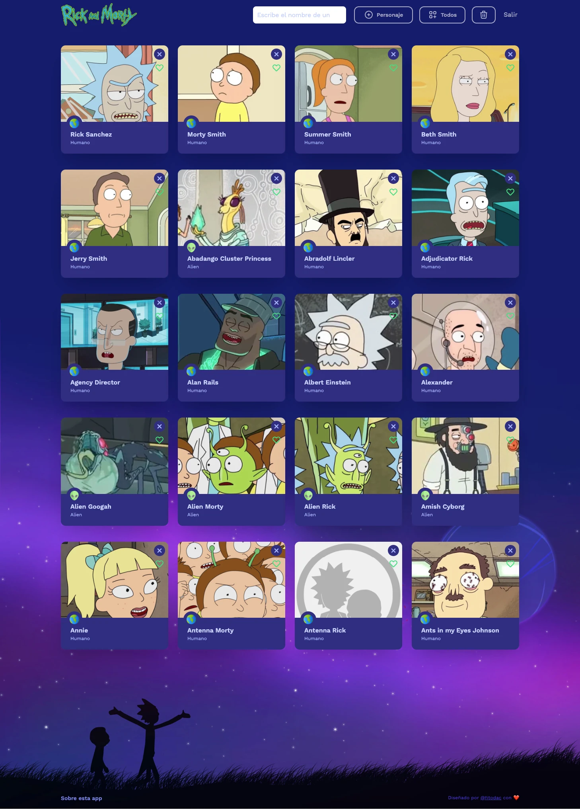

# Rick and Morty React App

This web application uses React technology in combination with TailwindCSS and the localforage library to create a fast and responsive user interface, and the Rick and Morty API to retrieve and display real-time information from the series.

The application has several features, such as:

- The ability to search for characters, add them randomly or add all of them.

- View detailed information about each character.

- Delete characters from the list.

- User authentication system.

- Possibility to select characters as favorites.

- Filter favorite characters by gender and/or sort them in ascending or descending order.

Personally, it was a great programming challenge and a deep pride to present a finished product using a technology that I was previously unfamiliar with.

Although the API has a vast number of characters, since this is a programming skills exercise, it has been limited to displaying a maximum of 20 characters.

Undoubtedly, React will be present in my future projects.